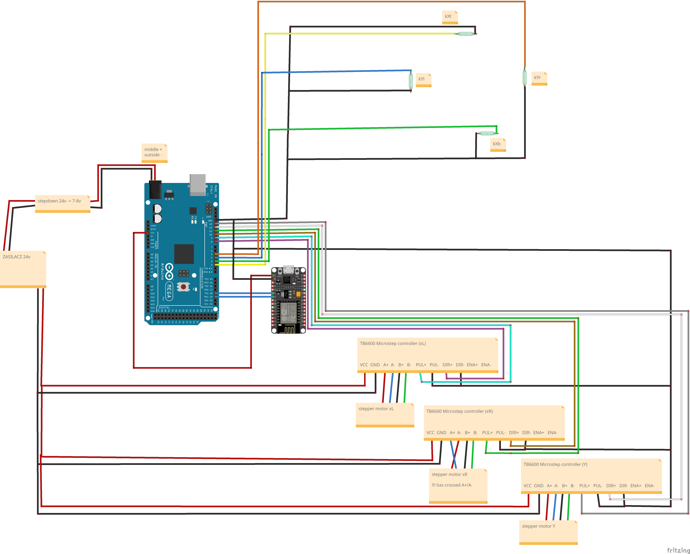

# Ouija

An Arduino-powered Ouija board cnc-like "robot" controlled over WiFi. A motorized planchette with a magnet moves across the board to spell out words on command.

## How it works

Two boards work together:

- **Arduino Mega** (`mega/`) drives three stepper motors (xL, xR, Y axis) through TB6600 controllers to position the planchette. On startup it auto-calibrates by homing against four limit switches, then loads character positions from EEPROM. It listens for text commands over its Serial1 UART.
- **ESP8266 / NodeMCU** (`esp/`) creates a WiFi access point and serves a small web UI. It bridges commands from the browser to the Mega over a software serial link and streams responses back.

## Hardware

- Arduino Mega 2560
- ESP8266 / NodeMCU
- 3× TB6600 Microstep stepper controllers (xL, xR, Y)
- 3× stepper motors
- 4× limit switches
- 24V power supply + 24V → 7–8V stepdown converter (powers the Mega)

## Wiring



### Mega motor pins

| Motor | DIR pin | STEP pin |
|-------|---------|----------|
| xL    | 8       | 9        |
| xR    | 10      | 11       |
| Y     | 12      | 13       |

> **Note:** The xR stepper motor has its red and blue wires swapped relative to xL and Y.

### Limit switches

| Switch | Mega pin |
|--------|----------|
| Top (kXt)    | 2 |
| Bottom (kXb) | 3 |
| Left (kYl)   | 4 |
| Right (kYr)  | 5 |

### Mega ↔ NodeMCU serial link

| Signal | Mega | NodeMCU |
|--------|------|---------|
| TX → RX | Serial1 TX | pin 13 |
| RX ← TX | Serial1 RX | pin 12 |

Both sides run at 9600 baud.

## Uploading the code (without Arduino IDE)

Install [arduino-cli](https://arduino.github.io/arduino-cli/) and add the required cores:

```shell
arduino-cli core install arduino:avr        # for Mega
arduino-cli core install esp8266:esp8266    # for NodeMCU
```

### Arduino Mega

```shell
# macOS / Linux
arduino-cli compile -b arduino:avr:mega -u -p /dev/ttyACM0 mega/

# adjust port as needed (e.g. /dev/tty.usbserial-XXXX on macOS)
```

### ESP8266 / NodeMCU

```shell
arduino-cli compile -b esp8266:esp8266:nodemcuv2 -u -p /dev/ttyUSB0 esp/
```

### WSL2 (Windows)

You need [USBIPD](https://github.com/dorssel/usbipd-win/releases). Run in PowerShell as admin:

```powershell
usbipd list
usbipd bind --busid <busid>
usbipd attach --wsl --busid <busid>
```

Then in WSL2:

```shell
lsusb                           # confirm device appears
sudo chmod a+rw /dev/ttyACM0   # grant port access if needed
```

Detach when done:

```powershell
usbipd detach --busid <busid>
usbipd unbind --busid <busid>
```

## Usage

1. Power both boards.
2. On your phone or laptop, connect to WiFi:
   - **SSID:** `NodeMCU_Serial`
   - **Password:** `serial1234`
3. Open a browser and go to `http://192.168.4.10`.
4. Type a command in the text box and press **Send**.

## Commands

| Command | Description |
|---------|-------------|
| `DISPLAY <text>` | Move planchette to each character in sequence (2s dwell per character) |
| `MOVE <x> <y>` | Move to arbitrary position — coordinates are 0–50 |
| `CALIBRATE` | Re-home against limit switches and re-detect board boundaries |
| `HOME` | Return to center |
| `CHARPOS <c> <x> <y>` | Override the stored position for character `c` (saved to EEPROM) |
| `GET_CHAR <c>` | Print the stored position for a single character |
| `LIST_CHARS` | Print positions for all stored characters |
| `SAVE_CHARS` | Manually persist current positions to EEPROM |
| `RESET_CHARS` | Reset all positions to factory defaults |
| `SET_SPEED <0-100>` | Set motor speed as a percentage |
| `GET_SPEED` | Query current speed setting |
